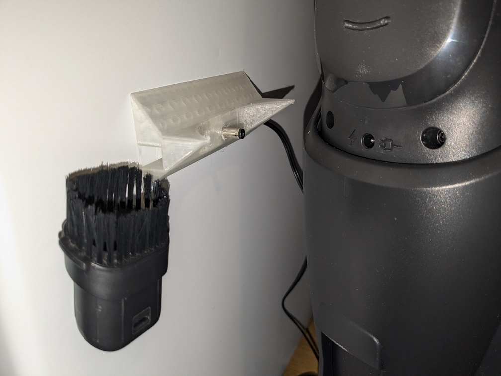
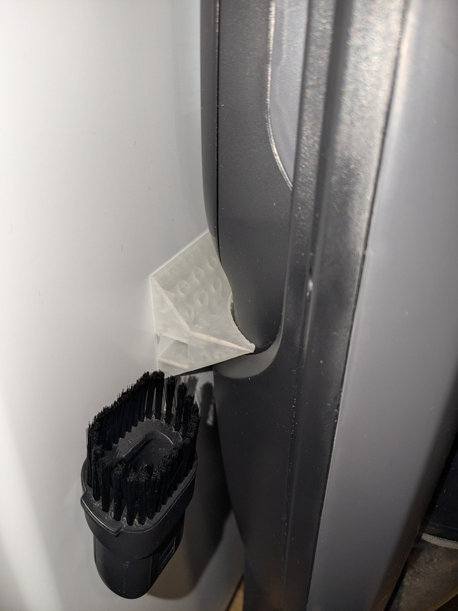
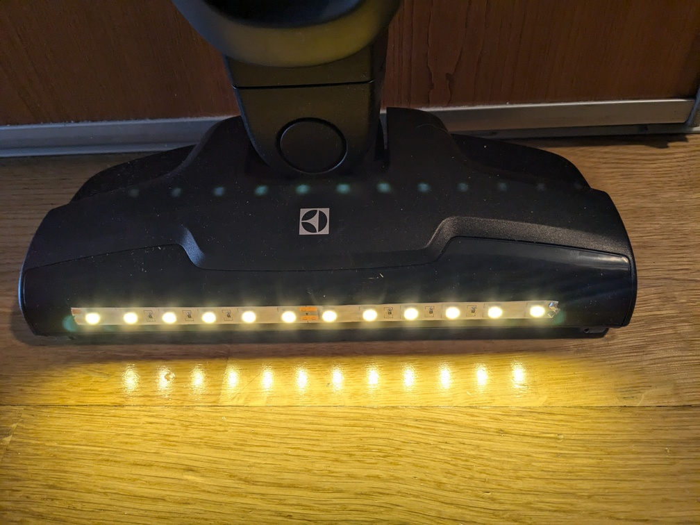

# Dock for 18V Electrolux Clean 500 (ES52CB18DG)

This stripped down version of a vacuum did not come with charging dock. Instead
it comes with a plain barrel jack DC power supply. Here is a wall attachment
for the barrel jack, which snugly fits the vacuum unit and guides the plug into
the charge port:

## Bonus features

The extra short nozzle (as shown on the left side of the pictures above) can be
attached to magnetic surfaces by gluing some small magnets to it.

This vacuum also lacked LED lights on the front of the floor brush, which are
common nowadays (e.g. the predecessor to this vacuum!). Luckily the floor brush
is motorized, and soldering some 24V LED-strips in parallel with that motor
works nicely:

